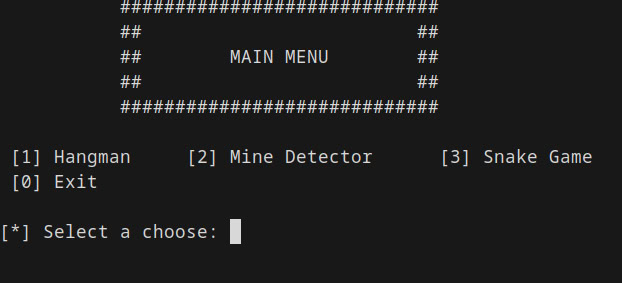
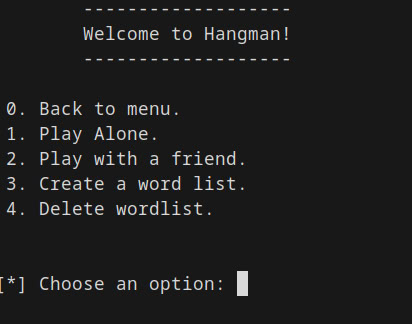

# Terminal Games
A collection of simple and fun terminal games made in C++ — perfect for playing when you're bored and you can play with your friends!

## Features

* **Hangman**: The classic word guessing game.

* **Snake Game**: The nostalgic snake game where you grow longer as you eat food.

* **Minesweeper**: A game of logic where you try to avoid mines and uncover safe spaces.

## Requirements

To build and run this project, ensure the following tools and libraries are installed:

1. **C++** Compiler (Clang or GCC)
2. **Make** (build automation tool)
3. **ncurses** (used to handle keyboard input and display text-based)

* For Arch Linux users
```bash
sudo pacman -S clang make ncurses5-compat-libs
```

* For Debian Linux users
```bash
sudo apt install clang build-essential libncurses5
```

### Instalation

#### Clone this repository

```bash
git clone https://github.com/GownKydo/terminal-games.git
cd terminal-games
```

### Compile the proyect

Write the command `make` and execute the file using: `./game`

### Screenshots




## MIT LICENCE

[LICENSE](/LICENSE)
